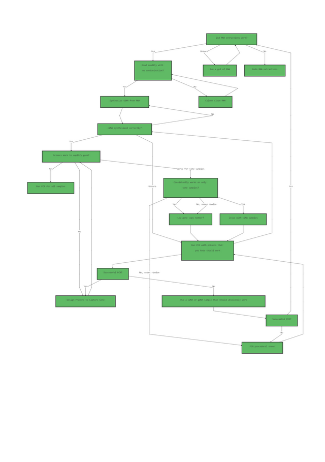
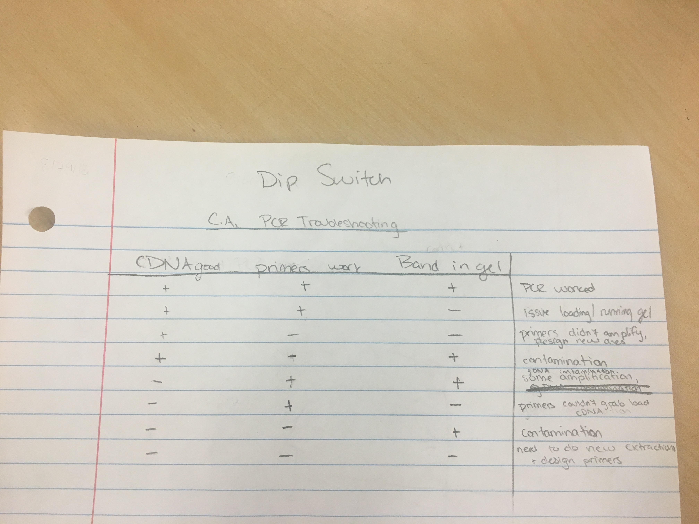

#Logic Tree

###Above is my logic tree for RNA extractions and PCR troubleshooting to determine which step may be causing problems when no bands are generated on the gel. Below is my dip switch table with a similar thought process looking at variables such as whether or not the cDNA is good, if the primers work or not, and if you get a band in the gel. Then, the results obtained or conclusions drawn by combinations of those are on the right.

#Dip Switch

