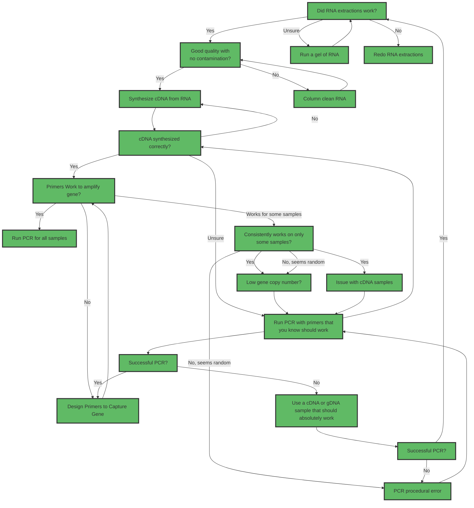

```mermaid
graph TD
A[Did RNA extractions work?] --> |Yes| AAA[Good quality with <br> no contamination?]
AAA --> |Yes| B[Synthesize cDNA from RNA]
AAA --> |No| AAAA[Column clean RNA]
AAAA --> AAA
A --> |Unsure| AA[Run a gel of RNA]
AA --> A
B --> C
C[cDNA synthesized correctly?]
A --> |No| D[Redo RNA extractions]
C --> |Yes| J
C --> |No| B
C --> |Unsure| E[Run PCR with primers that <br> you know should work]
E --> C


I[Design Primers to Capture Gene] --> J[Primers Work to amplify gene?]
J --> |Yes| K[Run PCR for all samples]
J --> |No| I
J --> |Works for some samples| L[Consistently works on only <br> some samples?]
L --> |Yes| M[Issue with cDNA samples]
L --> |No, seems random| N[PCR procedural error]
L --> |Yes| O[Low gene copy number?]
L --> |No, seems random| O
O --> E
N --> E
M --> E
E --> P[Successful PCR?]
P --> |Yes| I
P --> |No| Q[Use a cDNA or gDNA sample that should absolutely work]
Q --> R[Successful PCR?]
R --> |Yes| A
R --> |No| N

style A fill:#60ba65,stroke:#333,stroke-width:3px;
style AA fill:#60ba65,stroke:#333,stroke-width:3px;
style AAA fill:#60ba65,stroke:#333,stroke-width:3px;
style AAAA fill:#60ba65,stroke:#333,stroke-width:3px;
style B fill:#60ba65,stroke:#333,stroke-width:3px;
style C fill:#60ba65,stroke:#333,stroke-width:3px;
style D fill:#60ba65,stroke:#333,stroke-width:3px;
style E fill:#60ba65,stroke:#333,stroke-width:3px;
style I fill:#60ba65,stroke:#333,stroke-width:3px;
style J fill:#60ba65,stroke:#333,stroke-width:3px;
style K fill:#60ba65,stroke:#333,stroke-width:3px;
style L fill:#60ba65,stroke:#333,stroke-width:3px;
style M fill:#60ba65,stroke:#333,stroke-width:3px;
style N fill:#60ba65,stroke:#333,stroke-width:3px;
style O fill:#60ba65,stroke:#333,stroke-width:3px;
style P fill:#60ba65,stroke:#333,stroke-width:3px;
style Q fill:#60ba65,stroke:#333,stroke-width:3px;
style R fill:#60ba65,stroke:#333,stroke-width:3px;
```

